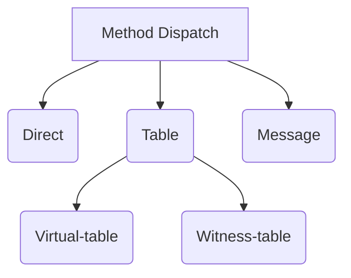

Выделенная вашему приложению память логически делится на три области:

1. Статическая память, в которой размещается код приложения, различные библиотеки, метаданные и глобальные переменные, необходимые для работы.
2. Автоматическая память, в которой хранятся все локальные для текущей области видимости параметры (`Stack`).
3. Динамическая память, в которой память выделяется динамически по запросу (`Heap`).

## Как iOS управляет памятью?

iOS использует `ARC` (Automatic Reference Counting) для управления памятью. `ARC` увеличивает retain count на 1 когда объект имеет strong reference. Если на объект нет strong reference retain count равен нулю и `ARC` освобождает память.

## Что такое ARC?

`ARC` - это специальный механизм автоматического подсчета ссылок на этапе компиляции. При использовании ARC память для объектов освобождается только тогда, когда на них имеется ноль сильных ссылок. ARC работает при компиляции, а подсчет ссылок в рантайме.

## Как работает ARC?

Каждый раз, когда вы создаете новый инстанс класса, ARC выделяет участок памяти для хранения информации об этом инстансе. В этой памяти хранится информация о типе инстанса, а также значения всех проперти, связанных с этим инстансом.

Когда инстанс больше не нужен, `ARC` освобождает память, которая использовалась этим инстансом, чтобы использовать для других целей. Инстансы класса не занимают память, когда они не нужны.

В том случае, если `ARC` освобождает инстанс, который используется, то доступ к его проперти и/или методам не будет доступен.
При попытке вызвать такой инстанс, в большинстве случаев ваше приложение крашнется (crash).

Для того, чтобы убедиться, что инстанс не исчезнет когда он нужен, `ARC` отслеживает количество проперти, констант и переменных ссылающихся на каждый инстанс класса. `ARC` не будет будет освобождать память инстанса до тех пор, пока существует хотя бы одна активная ссылка на него.

Для осуществления вышесказанного, всякий раз при присваивании проперти инстанса, константы или переменной, создается сильная ссылка на инстанс. Ссылка называется «сильной», потому что удерживает инстанс и не позволяет освобождать память до тех пор, пока эта сильная ссылка сохраняется(живет).

## Перечислите и расскажите о счетчиках ссылок?

1. `Weak`
2. `Strong`
3. `Unowned`

## Что такое strong reference?

Strong references используется для описания связей между объектами. Когда объект имеет сильную ссылку на другой объект, это создает `retain cycle`, который предотвращает освобождение памяти и увеличивает счетчик на 1.

## Что такое retain cycle?

`Retain Cycle` - ситуация, когда два объекта хранят ссылку друг на друга и пытаются удержать, что создает `retain cycle` и делает невозможным освобождение(release) памяти. В основном такой цикл случается в классах и кложах(closures). Замыкания «живут» в памяти, поэтому вызывая `self` (является ссылкой), необходимо убедиться, что вы решили проблему с `retain cycle`.

## В чем разница между unowned и unowned(unsafe)?

`unowned` гарантирует, что если что-то пойдёт не так, то отловится в trap и будет видна ошибка. С unowned всё ещё работает ARC и его накладные расходы. Плюс такие ссылки дополнительно требуют атомарности, а то ещё лишние такты. 

`unowned(unsafe)` - здесь нет никакого ARC, нет атомарных операций, но есть UB если что-то пойдёт не так.

## Что такое memory leak?

Утечка памяти - процесс неконтролируемого уменьшения объёма свободной оперативной или виртуальной памяти компьютера, связанный с ошибками в работающих программах, вовремя не освобождающих память от ненужных данных, или с ошибками системных служб контроля памяти.

Утечка памяти - это часть памяти, которая остается выделенной, но никогда не используется.
Утечка памяти происходит когда объект остается в памяти даже после того, как `lifecycle` завершился.
Вам следует избегать отношений `strong - strong`, которые создают retain cycle, порождающий утечку памяти.

## Что такое capture list?

`capture list` (список захвата) - процедура обработки «захваченных» ссылок. Если вы не используете `capture list`, то по умолчанию все выражения будут иметь `strong reference`. Для объявления `capture lists` используйте ключевое слово `weak` или `unowned`.
1. `weak` захваченные выражения являются `Optional` и не удерживаются замыканием, таким образом, они могут быть освобождены и установлены в nil.
2. Используем `unowned` если значение не будет `.none` до освобождения.


## Может ли value type передаваться по ссылке?

Замыкания всегда захватывают значение по ссылке, а не копированием, даже если это value type:

```swift
class Man {
    var name: String = "class Man"
    deinit { print("class \(Self.self) has deinit") }
}

var fn: (() -> Void)?

if true {
    let man = Man()
    fn = {
      print(man.name)
    }
    //fn = { [unowned man] in
    //    print(man.name)
    //}
    fn!()
}
print("Destroy scope")
```

По выводу на консоль видно, что экземпляр создается, однако перед завершением программы его деинициализатор не вызывается. Так как замыкание является внешним по отношению к условному оператору, а ссылка сильной, то Swift самостоятельно не может принять решение о возможности удаления ссылки и последующего уничтожения экземпляра. Для решения проблемы в замыкании необходимо выполнить захват переменной, указав при этом, что в переменной содержится слабая ссылка (раскомментируйте [unowned man]).


## Что такое circular dependencies?

Ошибка в дизайне проектирования. Когда два или более модуля прямо или косвенно зависят друг от друга.

## Объясните механизм COW?

`Copy-On-Write`, `COW` (механизм копирования при записи) используется для оптимизации процессов. Идея подхода `copy-on-write` заключается в том, что при чтении области данных используется общая копия, в случае изменения данных — создается новая копия:

```swift
func currentAddress(_ v: UnsafeRawPointer) {
    print(Int(bitPattern: v))
}

var arr: [Any] = [1, 3, 5, "Anna"]
var secondArr = arr

currentAddress(arr) // 5519730800
currentAddress(secondArr) // 5519730800
```

Оба массива ссылаются на один указатель в памяти `5519730800`. Попробуем добавить новый элемент в `secondArr`:

```swift
secondArr.append(23)

currentAddress(arr) // 5388678352
currentAddress(secondArr) // 5388689776
```

Как можно заметить ссылки ведут на разные области в памяти.
Это избавляет программу от лишних копирований, тем самым улучшая производительность.


## Что такое method dispatch?

`Method dispatch` — это процесс выбора имплементации метода при его вызове.

Виды диспетчеризации:



1. `Direct`

- [x] Самый быстрый тип диспетчеризации
- [ ] Отсутствие полиморфизма (протоколы)
- [ ] Отсутствие наследования (классы)

2. `Virtual-table`

- [ ] Медленнее, чем `Direct`
- [x] Реализует полиморфизм
- [ ] Отсутствие наследования

3. `Witness-table`

- [ ] Медленнее, чем `Direct`
- [x] Реализует полиморфизм
- [x] Реализует наследование

4. `Message`

- [x] `KVC` / `KVO`
- [x] Method swizzling
- [ ] Самый медленный

> ⚠️ Message используется только для совместимости с Obc-C runtime (NextStep классы)


## В чем разница между garbage collector и ARC?

Технически `ARC` является формой `GC`, но детерминированным: есть предсказуемость в поведении. Языки программирования как `java` и `C#` используют недетерминированный сборщик мусора. Это означает, что вы не можете точно сказать, когда объекты будут утилизированы, потому что этим управляет внешний процесс runtime.

Основным преимуществом `ARC` является детерминированное поведение и предсказуемая деконструкция. Объекты освобождаются немедленно, когда они больше не нужны.

Однако `ARC` не может работать с reference cycle без вмешательства разработчика. С другой стороны, основным преимуществом сборщика мусора заключается в обнаружении reference cycle.

## Что такое MemoryLayout и как посчитать размер протокола?

`MemoryLayout` - `enum`, с помощью которого можно [узнать информацию о размере][memory_layout], выравнивании и шаге какого-либо типа данных:

```swift
@frozen
public enum MemoryLayout<T> {
  /// The contiguous memory footprint of `T`, in bytes.
  ///
  /// A type's size does not include any dynamically allocated or out of line
  /// storage. In particular, `MemoryLayout<T>.size`, when `T` is a class
  /// type, is the same regardless of how many stored properties `T` has.
  ///
  /// When allocating memory for multiple instances of `T` using an unsafe
  /// pointer, use a multiple of the type's stride instead of its size.
  @_transparent
  public static var size: Int {
    return Int(Builtin.sizeof(T.self))
  }

  /// The number of bytes from the start of one instance of `T` to the start of
  /// the next when stored in contiguous memory or in an `Array<T>`.
  ///
  /// This is the same as the number of bytes moved when an `UnsafePointer<T>`
  /// instance is incremented. `T` may have a lower minimal alignment that
  /// trades runtime performance for space efficiency. This value is always
  /// positive.
  @_transparent
  public static var stride: Int {
    return Int(Builtin.strideof(T.self))
  }

  /// The default memory alignment of `T`, in bytes.
  ///
  /// Use the `alignment` property for a type when allocating memory using an
  /// unsafe pointer. This value is always positive.
  @_transparent
  public static var alignment: Int {
    return Int(Builtin.alignof(T.self))
  }
}
```

Рассмотрим пустой протокол `P`:

```swift
protocol P { }
print(MemoryLayout<P>.size) // 40
```

Обычный экзистенциальный контейнер по умолчанию содержит:
- Буфер на три машинных слова для хранимого значения. Имеем на x64: 8 + 8 + 8 = 24
- Ссылка на Метатип — ещё 8
- Ссылка на массив таблиц `Protocol Witness Table` - снова 8
Итого: 24 + 8 + 8 = 40

```swift
print(MemoryLayout<Sendable>.size) // 32
```

`Sendable` это маркер протокол, а значит он не содержит ссылки на массив таблиц Protocol Witness Table.
Итого: 40 - 8 = 32

```swift
print(MemoryLayout<AnyObject>.size) // 8
```

`AnyObject` - это специальный вид экзистенциального контейнера `Class Existential Containers`:
- Содержит указатель на память в хипе - это 8
- Нет ссылки на массив таблиц Protocol Witness Table
Итого: 8


```swift
print(MemoryLayout<Actor>.size) // 16
```

`Actor` наследуется от `AnyObject`, а значит Class Existential Containers:
- Содержит указатель на память в куче - это 8
- Есть ссылка на массив таблиц Protocol Witness Table - ещё 8 
Итого: 8 + 8 = 16

[memory_layout]: https://developer.apple.com/documentation/swift/memorylayout
