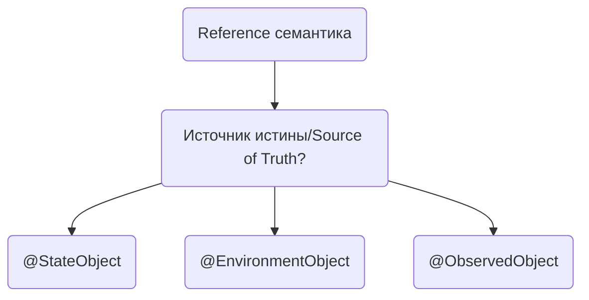
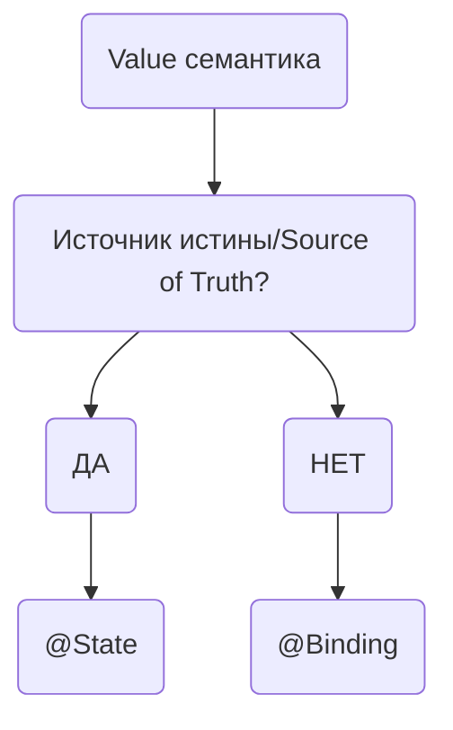

## Что такое декларативный синтаксис?

Декларативный синтаксис — это современная парадигма программирования, помогающая разработчиками писать код процедурно.
Используя такой подход, разработчик описывает кодом то, что он хочет написать, не обращая внимание на то, как это будет показано/реализовано.
SwiftUI использует декларативный синтаксис, поэтому вы можете просто указать, что должен делать ваш интерфейс, например:
вы пишите кодом, что хотите видеть `Image` вью внизу вашего экрана.

## Что такое View в SwiftUI?

`View`(вью) — это основной строительный блок UI. Вью наследуется от протокола `View`, который является типом представляющим часть UI приложения и имеет модификаторы (modifiers), используемые для настройки.

## Перечислите все ленивые (lazy) контейнеры/вью?

Называются ленивыми (`lazy`), потому что вью не создает все элементы сразу. Элементы выводятся на экран по мере необходимости.

`List`, `LazyVStack`, `LazyHStack`, `LazyHGrid`, `LazyVGrid`, `Table`.

## Что такое модификаторы в SwiftUI?

С помощью `Modifiers`(модификатора) можно добавить определенное изменение вью. SwiftUI предоставляет около 100-та собственных/встроенных модификаторов, таких как: `.padding()`, `.background()` и `.offset()`.
Так же вы можете создать собственный модификатор, который делает что-либо с вашей вью.

## Что будет если применить модификатор к вью? 

Применив модификатор к вью, добавляется определенное поведение, которое вы ожидаете и возвращается новая вью.

## Какие категории View вы знаете?

`Lazy` вью, как `List` подгружают элементы UI, когда они находятся или будут находиться внутри области прокрутки.
Таким образом, не все данные из вью хранятся в текущей вью. Попробуем назвать элементы UI, которые генерируются во вью, `displayables`. Вью `SwiftUI` может иметь `0` или `> 0` `dispayables`.

Когда дело доходит до сравнения, можем выделить 4-ре основных категории:

1. `Unary`: Вью с единственным displayable, таким как shapes, colors, controls и labels.
2. `Structural`: Вью которая принимает `0` или `> 0` и комбинирует их в некоторое подмножество: `ForEach`, `EmptyView` и вью которые строятся с `ViewBuilder`, такие как `TupleView` и `_ConditionalView`.
3. `Container`: Вью, которые принимают другие вью и управляют их расположением: `HStack`, `VStack`, `List`, `LazyVStack`.
4. `Modifiers`: Вью, которое добавляет и изменяет внешний вид и/или поведение.

<!-- Examples: the views that modifiers such as .border, .padding, .frame generate, which are of type ModifiedContent.
You can find the types of the structural views that view builders create in the documentation. (As a recap: Multiple statements are combined into a TupleView. if-statements without else create an optional views, which are views themselves. if-statements with else become _ConditionalViews.) -->

<!-- Container views take the displayables of the view they wrap and put them on screen. I will call a displayable that is rendered a graphic. HStack and VStack always make graphics for all the displayables in a view and lay them out. Other containers, such as List are lazy and do not immediately turn all displayables into graphics. Container views present themselves as views with a single displayable again to views higher up in the hierarchy. -->

<!-- Modifiers applied to views create ModifiedContent views. Modifiers apply an effect to all the displayables of another view individually. A .border modifier used on a TupleView will put a border graphic on top of all the displayables of the TupleView. This means modifiers can have displayables that are put on screen multiple times, so a single displayable is turned into multiple graphics. -->

Каждая иерархия View содержит примитивные View, и каждое примитивное View будет представлять собой комбинацию типов View перечисленных выше:

```swift
struct MyView: View {
  @State var showSecret = false

  var body: some View {
    VStack {
      Group {
        Button("Show secret") { showSecret.toggle() }
        if showSecret {
          Text("Secret")
        } else {
          Color.red
        }
      }
      .padding()
    }
  }
}
```

SwiftUI необходимо отслеживать иерархию вью в `runtime`. Ниже схематично изображена `MyView()`, которая хранит ссылки и состояние вью.


## Что такое ViewModifier?

`ViewModifier` - это протокол с помощью которого можно кастомизировать другой модификатор(modifier) или вью.
Вы можете объединить несколько модификатор, которые в конце вернут вью. Чтобы изменить `UIView` в `UIKit`, вы используете проперти вью. В UIKit вы, вероятно, используете `YourView.backgroudColor = .red`, чтобы настроить UIView. Такой подход называет императивным. Для кастомизации в декларативном стиле, в SwiftUI мы просто описываем как вью должна выглядеть, используя `ViewModifier`.

## Что такое property wrapper?

Проперти враппер (property wrapper) добавляет слой разделения между кодом, отвечающим за хранение свойств и кодом, отвечающим за объявление этого property wrapper.

Представим, что нужно написать метод, проверяющий потокобезопасность или хранение данных в БД.
Вместо того, чтобы писать 2 разных метода, мы напишем один property wrapper и повторно применим его к нескольким свойствам:

```swift
@propertyWrapper
struct TwelveOrLess {
    private var number = 0
    var wrappedValue: Int {
        get { return number }
        set { number = min(newValue, 12) }
    }
}

struct SmallRectangle {
    @TwelveOrLess var height: Int
    @TwelveOrLess var width: Int
}

var rectangle = SmallRectangle()
print(rectangle.height)
// Выведет "0"

rectangle.height = 24
print(rectangle.height)
// Выведет "12"
```

## Какие property wrapper вы знаете?

На текущий момент в SwiftUI имеется более 17-ти оберток, каждая из которых предоставляет разный функционал:

<details> 
  <summary>@Published</summary>

   `@Published` применяется к проперти внутри `ObservableObject` и при изменении значения сообщает SwiftUI о перерисовки любой вью, которая использует эту проперти.
</details>

<details> 
  <summary>@State</summary>

   `@State` property wrapper используется внутри `View` объекта и позволяет вашей вью реагировать на любые изменения. Данная обертка не принимает данные с других объектов. В качестве лучшей практики вы должны пометить свои проперти @State как `private`. Никакие внешние источники не должны изменять ваш @State проперти. В большинстве случаев используется для простых типов данных как `Int`, `String`, `Bool` и т.д.
</details>

<details> 
  <summary>@Binding</summary>

   `@Binding` property wrapper используется для передачи значений в дочернюю(child) вью. Вью принимающая биндинг может читать проперти, реагировать на изменения от родительской вью и имеет доступ на запись проперти.
</details> 

<details> 
  <summary>@StateObject</summary>

   `@StateObject` схож со `@State`, но использует более сложные типы данных и применяется к `ObservableObject`. `ObservableObject` принимает reference type (class) и информирует SwiftUI когда в одном из `@Published` проперти произошли изменения.

   > ⚠️ Вы должны использовать `@StateObject` только один раз для каждого объекта.
</details> 

<details> 
  <summary>@ObservedObject</summary>

   `@ObservedObject` схож со `@StateObject`, за исключением того, что в нем не упоминается создание или хранение инстанса. `ObservedObject` используется для отслеживания изменений уже созданного объекта c использованием `@StateObject`.

   > ⚠️ До создания `StateObject` использовали `ObservedObject` для сохранения и хранения объектов, но это было не безопасно. Иногда `ObservedObject` мог случайно освободить объект, который он хранил. Поэтому была создана проперти враппер `StateObject`.
</details> 

<details> 
  <summary>@EnvironmentObject</summary>

  Временами нужно получить доступ к объекту из разных вьюх в приложении или во всех дочерних вьюхах.
  Достичь такого можно с помощью `@EnvironmentObject`. Проперти к которому применили `EnvironmentObject` должны наследоваться от `ObservableObject` протокола.
  Применяем модификатор `.environmentObject()` и объект доступен во всех вью, к которой применили модификатор.

  `@EnvironmentObject` похож на `@ObservedObject`. Основное различие в том, что `@EnvironmentObject` доступен в большем диапазоне, во множестве вложенных вью.
</details>

<details> 
  <summary>@Environment</summary>

  Если вы знакомы с переменными окружения `env` в Linux, то вы сразу поймете о чем идет речь.
  `@Environment` считывает значения окружения ОС и перерисовывает вью если значение изменяется. Чтобы применить `@Environment` проперти к вью используйте `.environment` модификатор.

  Список всех значений [доступен в документации][environmentValues].
</details>

<details> 
  <summary>@AppStorage</summary>

  `@AppStorage` является оберткой над `UserDefaults`. Используйте обертку для хранения маленьких, простых значений. 
  
  > ⚠️ Не следует хранить `CVV` код от кредитной карты.
</details>

[environmentValues]: https://developer.apple.com/documentation/swiftui/environmentvalues


## Назовите property wrapper, которые объявляют reference семантику?

SwiftUI предоставляет property wrappers, которые объявляют reference type в качестве источника истины (source of truth): `@ObservedObject`, `@StateObject` и `@EnvironmentObject`.
Для использования этих врапперов, необходимо чтобы класс стал наблюдаемым (observable).



##  Назовите property wrapper, которые объявляют value семантику?

Существует 2 враппера, которые является `value` типом: `@State` и `@Binding`.
Из них только `@State` является источником истины (source of truth):



## Как сделать класс наблюдаемым?

Для этого необходимо подписать класс на протокол `ObservableObject`. 
Если мы хотим, чтобы проперти класса реагировало на изменения и обновляло вью, то нужно добавить атрибут `@Published`:

```swift
class Counter: ObservableObject {
  @Published
  var increase: Int = 1
}
```

> ℹ️ `@Published` — это проперти враппер, но в контексте применения к свойствам класса — атрибут.


## Состояние сцены и переход (Scene phases and transitions)

Во время выполнения приложения, сцены могут переходить между тремя состояниями:

- `активная` — сцена активна и пользователь может взаимодействовать с ней.
- `неактивная` — сцена видна, но взаимодействие с ней отключено системой. Например, в режиме мультизадачности, вы можете увидеть список приложений, но эта панель не является активной.
- `фон` — Приложение работает, но сцена не видна в UI. Сцена переходит в это состояние перед завершением работы приложения.


Узнать текущую сцену можно из значения среды `scenePhase`.

## Какие модификаторы изменяют View life cycle events?

SwiftUI включает три модификатора, которые реагируют на события жизненного цикла вью:

- `onAppear(perform:)` выполняет действие при каждом появлении вью, даже если вью появилась не первый раз.
- `onDisappear(perform:)` выполняет действие при уходе с вью.
- `task(priority:_:)` выполняет действие в асинхронной среде при появлении вью. Перестает выполнять при уходе с вью.

> ⚠️ Ключевая разница между `onAppear` и `task` в том, что покидая вью `onAppear` не останавливает выполнение задачи, а `task` наоборот автоматически запускает и останавливает.
